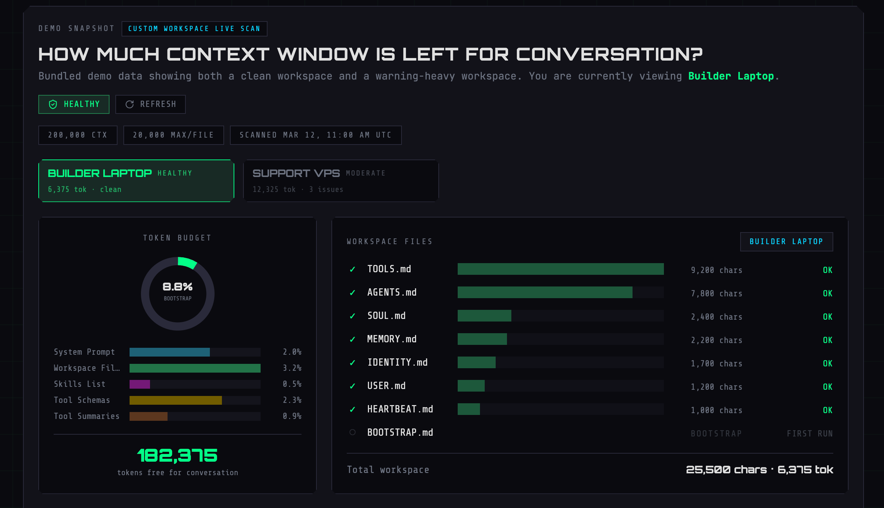

<div align="center">

# OpenClaw Context Doctor

**在对话开始之前，先看清你的 AI Agent 上下文窗口已经被吃掉了多少。**

[](https://nextjs.org/)
[](https://react.dev/)
[](https://tailwindcss.com/)
[](./LICENSE)
[](https://www.voxyz.space/)

[English](./README.md) | [中文](./README.zh-CN.md)

<br />



<br />

</div>

---

[OpenClaw](https://www.voxyz.space/) 生态的一部分——面向 AI Agent 运维者的开源工具链。

## 问题

每个 agent 平台都会在用户说第一句话之前，悄悄把 system prompt、workspace 文件、tool schema 和 skill 定义塞进上下文窗口。当这些隐形开销越来越大，对话质量就会下降——但没有任何面板告诉你发生了什么。

**Context Doctor 让这种压力变得可见。**

## 功能

| | 特性 | 说明 |
|---|------|------|
| **1** | 双数据模式 | 在内置 demo 数据和实时文件系统扫描之间切换 |
| **2** | Bootstrap 检查 | 扫描 8 个标准 OpenClaw 文件，检测截断 |
| **3** | Skill 发现 | 在 workspace 以及常见的 repo / Codex / Claude / system 技能目录中查找 `SKILL.md` |
| **4** | 预算可视化 | 动画环形图 + 分段条形图展示开销 vs 可用 token |
| **5** | 健康分类 | 根据 bootstrap 占比自动标记 Healthy / Moderate / Heavy |
| **6** | 快照对比 | 当加载的数据本身包含多个 workspace 时，可在单个快照中对比它们 |
| **7** | 安全扫描 | 路径白名单机制，不允许无限制的目录浏览 |

## 快速开始

```bash
git clone https://github.com/Heyvhuang/openclaw-context-doctor.git
cd openclaw-context-doctor
pnpm install
cp .env.example .env.local
pnpm dev
```

打开 [http://localhost:3000](http://localhost:3000)。**Demo Snapshot 开箱即用**，无需任何配置。

## 环境变量

要启用 **Local Scan**，编辑 `.env.local`：

```env
CONTEXT_DOCTOR_ALLOWED_ROOTS=/Users/you/projects,/Users/you/.openclaw/workspace
CONTEXT_DOCTOR_WORKSPACE=/Users/you/projects/my-agent
CONTEXT_DOCTOR_CTX_SIZE=200000
```

| 变量 | 是否必填 | 说明 |
|------|:--------:|------|
| `CONTEXT_DOCTOR_ALLOWED_ROOTS` | Local Scan 必填 | 逗号分隔的绝对路径，扫描 API 只接受这些根目录下的路径 |
| `CONTEXT_DOCTOR_WORKSPACE` | — | 默认 workspace 路径，扫描请求不传 `workspacePath` 时使用 |
| `CONTEXT_DOCTOR_CTX_SIZE` | — | 上下文窗口大小（token 数），默认 `200000` |

## 数据模式

| 模式 | 接口 | 做什么 |
|------|------|--------|
| **Demo Snapshot** | `GET /api/context-doctor/mock` | 返回内置 mock 数据——两个 workspace，一个健康，一个有告警 |
| **Local Scan** | `POST /api/context-doctor/scan` | 读取真实文件系统，需要配置 `CONTEXT_DOCTOR_ALLOWED_ROOTS`，更适合本地或私有部署 |

## API 参考

<details>
<summary><code>GET /api/context-doctor/mock</code></summary>

返回内置 `ContextDoctorSnapshot`，无需认证和配置。

```bash
curl http://localhost:3000/api/context-doctor/mock
```

</details>

<details>
<summary><code>POST /api/context-doctor/scan</code></summary>

扫描真实 workspace 目录。

```bash
curl -X POST http://localhost:3000/api/context-doctor/scan \
  -H "Content-Type: application/json" \
  -d '{"workspacePath":"/Users/you/projects/my-agent","ctxSize":200000}'
```

**请求体：**

| 字段 | 类型 | 必填 | 说明 |
|------|------|:----:|------|
| `workspacePath` | `string` | — | 绝对路径，不传则回退到 `CONTEXT_DOCTOR_WORKSPACE` |
| `ctxSize` | `number` | — | 上下文窗口大小覆盖值 |

**错误码：** `400` 请求体无效，`403` 路径不在白名单内，`404` 路径不存在，`500` 扫描出错。

</details>

如果是公开预览站，建议默认关闭 `Local Scan`，除非这个部署本身就是私有的，并且你接受向访问者暴露 workspace 元数据。

## 健康分类

```
Healthy     bootstrap < 10%    ████░░░░░░  对话空间充足
Moderate    bootstrap 10–15%   ██████░░░░  可用但值得关注
Heavy       bootstrap > 15%    █████████░  上下文压力明显
```

## 项目结构

```
app/
  api/context-doctor/
    mock/route.ts ·············· GET  — 内置 demo 快照
    scan/route.ts ·············· POST — 实时文件系统扫描
  globals.css ·················· 暗色主题、CSS 变量、chamfer 裁切
  layout.tsx ··················· 根布局 + Google Fonts
  page.tsx ····················· 首页
components/
  ContextDoctorDemo.tsx ········ 环形图、文件表格、skill 列表、状态徽章
  ContextDoctorExperience.tsx ·· 数据模式切换、扫描表单、状态栏
lib/
  context-doctor.ts ············ 核心扫描逻辑
  context-doctor-snapshot.ts ··· TypeScript 类型 + 构建函数
  context-doctor-mock.ts ······· Mock 数据生成器
  context-doctor-security.ts ··· 环境变量解析 + 路径校验
  utils.ts ····················· cn() 类名工具
test/
  context-doctor.test.js ······· 单元测试
  context-doctor-api.test.js ··· API 路由测试
```

## 技术栈

| | |
|---|---|
| **框架** | Next.js 16 (App Router) |
| **UI** | React 19 · Tailwind CSS v4 · Framer Motion |
| **图标** | Lucide React |
| **字体** | Orbitron · JetBrains Mono · Share Tech Mono |
| **测试** | Node.js 内置 test runner |
| **包管理** | pnpm |

## 开发

```bash
pnpm dev        # 开发服务器 localhost:3000
pnpm build      # 生产构建
pnpm test       # 运行测试
```

## 这个仓库不是什么

这是一次干净的提取——一个可移植的参考实现。它**不**包含 Supabase、远端 VPS 快照拉取、更大的运维产品界面或营销站页面。

## 许可证

[MIT](./LICENSE)

## 参与贡献

欢迎提 Issue 和 PR — [github.com/Heyvhuang/openclaw-context-doctor](https://github.com/Heyvhuang/openclaw-context-doctor)

了解更多关于 OpenClaw 项目：[voxyz.space](https://www.voxyz.space/)
